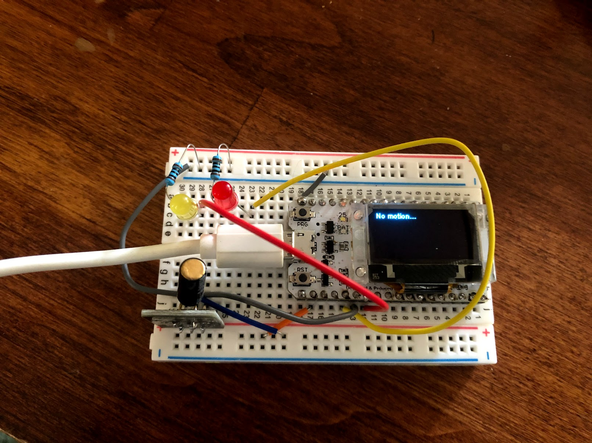

# Arduino + Heltec ESP 32 + AWS IoT - Shock Sensor

This is a simple Arduino project that uses [this Heltec ESP 32 board](https://www.amazon.com/Development-0-96inch-Display-Arduino-Compatible/dp/B07428W8H3) with a built-in OLED display.

I've wired the board with a [shock sensor from this kit](https://www.amazon.com/kuman-K5-USFor-Raspberry-Projects-Tutorials/dp/B016D5L5KE) and an LED with a 100 ohm resistor.

When a shock (movement) is detected, the LED turns on and publishes a message to AWS IoT Core. 

Inspired by this blog: 

* https://aws.amazon.com/blogs/compute/building-an-aws-iot-core-device-using-aws-serverless-and-an-esp32/

## Notes

1. The Heltec board does require some soldering. 

2. Be sure to install the MQTT client from Arduino Library Manager authored by Joel Gaehwiler. There are a lot of MQTT libraries for Arduino, and not all of them seem to support certificate-based authentication / mTLS needed by AWS IoT Core. 

# Demo

Once the board turns on, it connects to WiFi and AWS IoT, and then waits for either the sensor to activate from motion or an incoming MQTT message from AWS IOT: 

If I physically move the board, the sensor activates, triggers a red LED, and publishes an MQTT message to the `esp32/shockAlert` topic in AWS IoT: 

Using the "Test" section of the AWS IoT Console to subscribe to this topic and see the message come in almost immediately: 

I can also use the IoT Console to publish messages. In this case, the device subscribes itself to the `esp32/alert` topic: 

And finally, the device is subscribed to the topic and will activate a yellow LED and show the received message on the OLED dispay: 

